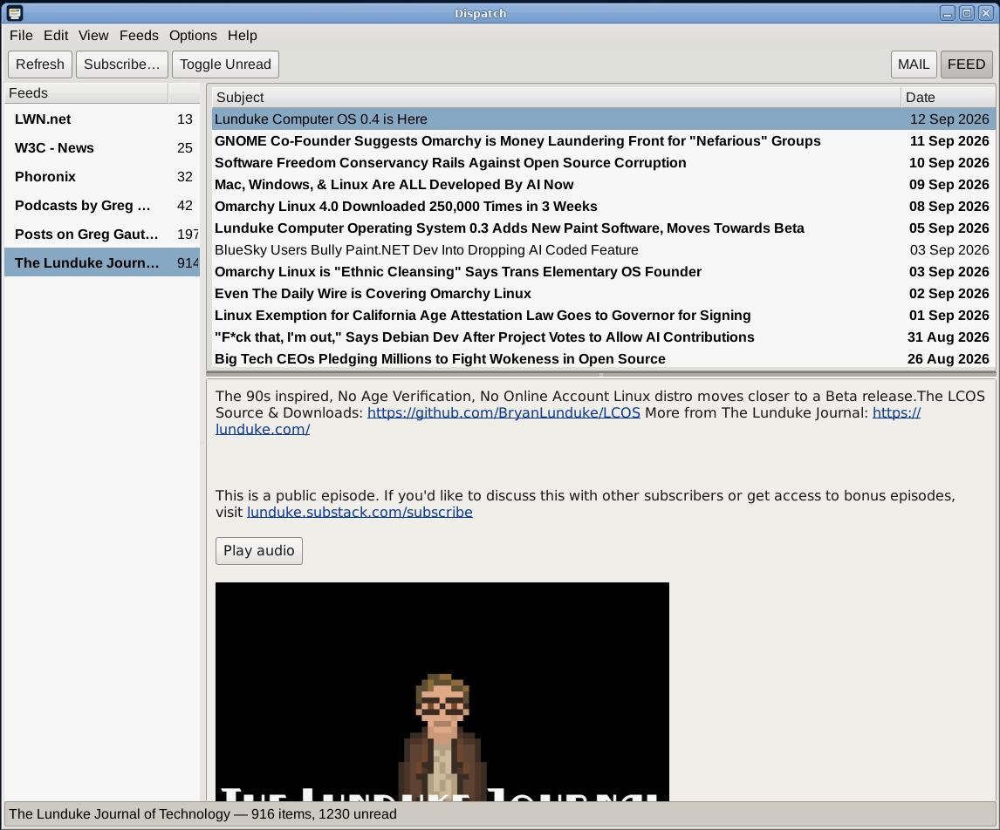
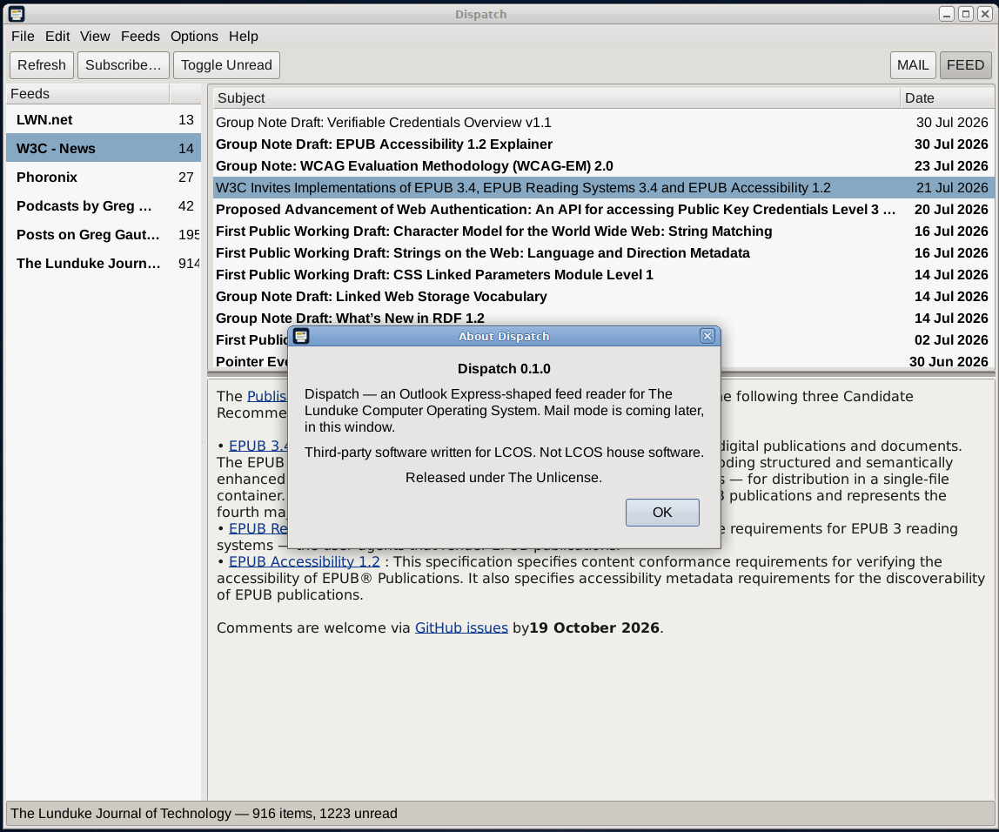

# Dispatch

**Vended by Grok Build**



An **Outlook Express-shaped** feed reader and mail client for The Lunduke Computer Operating System (LCOS). MAIL and FEED are modes of the same window.

Binary: `dispatch`. Unlicense.

LCOS itself: [https://github.com/BryanLunduke/LCOS](https://github.com/BryanLunduke/LCOS)



## Status

**v0.2.0.** Feed mode as before, plus Mail: IMAP/SMTP STARTTLS, Maildir, compose, threads, Ephemeris address picker. See [INSTALL.md](INSTALL.md).

| Doc | What |
|---|---|
| [INSTALL.md](INSTALL.md) | `.deb`, tarball, AppImage, git build |
| [DEVELOPMENT.md](DEVELOPMENT.md) | Locked decisions, architecture, milestones M0–M6, branching, semver, lint |

## Build

```
sudo apt install build-essential meson ninja-build pkg-config g++ libgtkmm-3.0-dev libxml2-dev libsoup-3.0-dev libfontconfig1-dev libetpan-dev libgmime-3.0-dev clang-format cppcheck
meson setup build
meson compile -C build
./build/dispatch
```

PR lint gate: `./scripts/lint.sh` (CI runs this; no `--fix`). Format `src/` locally with `./scripts/lint.sh --fix`.

## License

[The Unlicense](https://unlicense.org). See [UNLICENSE](UNLICENSE).
